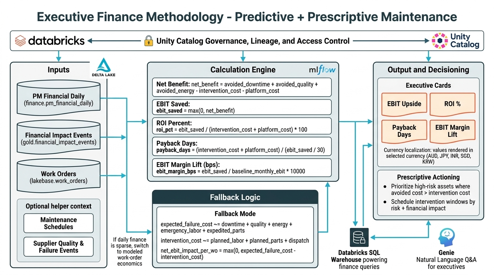

# OT PdM Intelligence

[](#technology-stack)
[](./LICENSE)
[](#validation-and-tests)

Config-driven predictive and prescriptive maintenance application built on Databricks (DABs + Jobs + DLT + MLflow + Apps) with a single codebase that supports multiple industry deployments.

## Table of Contents

- [Platform Overview](#platform-overview)
- [Business and Technical Functionality](#business-and-technical-functionality)
- [System Architecture](#system-architecture)
- [End-to-End Code Flow](#end-to-end-code-flow)
- [Repository Sections](#repository-sections)
- [Data Layers and Key Tables](#data-layers-and-key-tables)
- [API and UI Sections](#api-and-ui-sections)
- [Quick Start (15 Minutes)](#quick-start-15-minutes)
- [Deployment Modes](#deployment-modes)
- [Simulator and Fault Injection](#simulator-and-fault-injection)
- [Localization and Currency](#localization-and-currency)
- [Executive Finance Methodology](#executive-finance-methodology)
- [Genie and Retrieval](#genie-and-retrieval)
- [Validation and Tests](#validation-and-tests)
- [Technology Stack](#technology-stack)
- [License](#license)

## Platform Overview

This application combines:

- predictive maintenance (anomaly + remaining useful life),
- prescriptive maintenance (recommended action pathways),
- financial impact context (avoided loss, intervention cost, risk exposure),
- governed AI operations (Unity Catalog + lineage + model lifecycle traceability).

It is designed to support executive, operator, and technical workflows from one integrated solution.

## Business and Technical Functionality

### Predictive capabilities

- Asset-level anomaly and severity scoring
- Remaining useful life trends
- Fleet health rollups and critical risk visibility
- Failure mode contextualization

### Prescriptive capabilities

- Intervention timing recommendations
- Action options (approve, reject, defer)
- Financial consequence framing per action path
- Decision trace persistence for governance and operations

### Operational views

- Fleet overview and risk matrix
- Asset drilldown and hierarchy context
- Stream health and ingestion observability
- Simulator-driven scenario rehearsal

## System Architecture

```text
Source systems (Simulator / Zerobus / PI / ERP context)
  -> Bronze Delta landing
  -> DLT Bronze normalization
  -> DLT Silver feature engineering + OT/PI alignment
  -> DLT Gold predictions + maintenance + finance outputs
  -> MLflow training and scoring jobs
  -> FastAPI service layer
  -> React application (Fleet, Finance, Geo, Model, Simulator, Data Hub)
```

## End-to-End Code Flow

1. **Ingest**
   - `core/zerobus_ingest/connector.py` and simulator feeds land telemetry into Bronze.
2. **Normalize and align**
   - `core/dlt/bronze.py` standardizes incoming records.
   - `core/dlt/silver.py` computes features and OT/PI alignment.
3. **Materialize business outputs**
   - `core/dlt/gold.py` publishes predictions, alerts, and finance-aware outputs.
4. **Model lifecycle**
   - `core/ml/train.py` trains and registers models.
   - `core/ml/batch_score.py` scores using registered aliases.
5. **Serve to application**
   - `app/server.py` assembles operational and executive payloads.
6. **Render and action**
   - `app/src/App.jsx` and component modules render sections and trigger actions.
7. **Persist operator decisions**
   - Action APIs write durable decision traces and refresh portfolio-level summaries.

## Repository Sections

| Section | Path | Purpose |
|---|---|---|
| App backend | `app/server.py` | API orchestration, SQL queries, simulator hooks, response shaping |
| App frontend | `app/src/` | Fleet, Finance, Geo, Data Hub, Simulator, Model UX |
| DLT pipelines | `core/dlt/` | Bronze/Silver/Gold transformations |
| ML modules | `core/ml/` | Feature prep, training, scoring, model logic |
| Simulator | `core/simulator/` | Telemetry and fault generation |
| Bundle resources | `databricks.yml` | Jobs, pipelines, app, variables, schedules |
| Bootstrap orchestration | `RUNME_BOOTSTRAP_ALL.py` | Multi-industry workspace setup and seed |
| Automation scripts | `tools/` | Deploy, bootstrap, reconcile, seed utilities |
| Industry configs | `industries/` | Per-industry prompts, seeds, deployment matrix |
| Test suite | `tests/` | API, ML, simulator, pipeline and integration tests |

## Data Layers and Key Tables

### Bronze

- Raw and normalized ingestion tables
- PI and OT landing paths
- Manual retrieval chunk storage

### Silver

- `sensor_features`
- `ot_pi_aligned`

### Gold

- `feature_vectors`
- `pdm_predictions`
- `maintenance_alerts`
- `financial_impact_events`

## API and UI Sections

### Backend APIs

- **Fleet and executive summary APIs**: Assemble portfolio KPIs, top-risk assets, alert concentration, and executive finance rollups from Gold outputs for the landing dashboard.
- **Geo site and asset APIs**: Return site-level and asset-level context for map drilldowns, including currency-aware financial impact fields for localized decision views.
- **Simulator control APIs**: Trigger fault injection, scoring, and scenario progression so demo and validation runs can populate Bronze/Silver/Gold pathways on demand.
- **Recommendation action APIs**: Persist approve/reject/defer operator decisions and return refreshed status so actioned alerts are traceable and auditable.
- **Data discovery and concierge APIs**: Expose table-level availability, row counts, freshness, and guided dataset context to speed investigation in the Data Hub experience.
- **Agent and Genie chat APIs**: Route domain prompts with governed context (industry, site, metrics, manual chunks) and return grounded responses for supervisor workflows.

### UI sections

- **Fleet Health**: Executive entry point showing current reliability posture, critical asset distribution, and prioritized action queue.
- **Finance**: Converts maintenance risk into economic terms such as avoided impact, intervention cost, and aggregate value protection.
- **Stoppage**: Highlights production interruption risk and line-level operational impact so teams can align maintenance timing with output commitments.
- **Data Discovery Hub**: Provides searchable dataset visibility, freshness signals, and guided access paths for analysts and operators.
- **Geo Map**: Shows site and asset condition geographically, enabling rapid location-based triage with localized currency context.
- **Hierarchy (ISA-95)**: Organizes health and risk from enterprise to line/tool level so users can navigate root context quickly.
- **Asset and Stream**: Combines asset-level diagnostics with recent telemetry stream behavior to connect model outputs to raw operating signals.
- **Model**: Surfaces anomaly and RUL outputs, confidence cues, and model-driven recommendation context for technical validation.
- **Simulator**: Generates controlled warning/critical scenarios to rehearse response workflows and verify end-to-end data propagation.

## Quick Start (15 Minutes)

### Prerequisites

- Databricks CLI authenticated to target workspace
- Python 3.10+
- Node.js 18+ (for frontend build/update paths)

### Recommended path

1. Clone repository.
2. Run quickstart:
   - `./RUNME_15_MIN.sh --target dev`
3. Verify app and data:
   - App is running in Databricks Apps.
   - Bronze/Silver/Gold tables are populated.
   - Finance and simulator pages show non-empty outputs.

## Deployment Modes

### Quickstart mode

- `./RUNME_15_MIN.sh --target dev`
- Fast path to provision shared resources and bootstrap all industries.

### Full mode

- `python tools/deploy_bundle_and_bootstrap.py --mode full --target dev --industries mining,energy,water,automotive,semiconductor`
- Deploys all configured industry variants and runs full bootstrap sequence.

## Simulator and Fault Injection

- Simulator can inject warning/critical scenarios for demonstration and validation.
- Bulk injection supports all industries and table paths (bronze/silver/gold visibility).
- Relevant endpoints and controls are wired through `app/server.py` and simulator UI actions.

## Localization and Currency

- Supported display currencies include `USD`, `AUD`, `JPY`, `INR`, `SGD`, `KRW`, plus `AUTO`.
- Geo and financial sections are currency-aware and site-context-aware.
- Language behavior can localize prompts and guidance for selected currency contexts.

## Executive Finance Methodology

The executive finance panel computes ROI, payback, and EBIT impact from maintenance outcomes.



### Primary source path

- Preferred source table: `<catalog>.finance.pm_financial_daily` (last 30-day aggregation window)
- Supplementary event context: `<catalog>.gold.financial_impact_events`
- Work-order context: `<catalog>.lakebase.work_orders` (when available)

### Core formulas

- `net_benefit = avoided_downtime_cost + avoided_quality_cost + avoided_energy_cost - intervention_cost - platform_cost`
- `ebit_saved = max(0, net_benefit)`
- `roi_pct = ebit_saved / (intervention_cost + platform_cost) * 100`
- `payback_days = (intervention_cost + platform_cost) / (ebit_saved / 30)` (30-day run-rate assumption)
- `ebit_margin_bps = ebit_saved / baseline_monthly_ebit * 10,000`

### Work-order level impact

For each recommended work order:

- `expected_failure_cost` is estimated from anomaly/risk severity and cost-rate assumptions.
- `intervention_cost` is estimated from planned labor + planned parts + dispatch.
- `net_ebit_impact = max(0, expected_failure_cost - intervention_cost)`.

### Fallback behavior

If `pm_financial_daily` is sparse/unavailable, the app falls back to modeled work-order economics derived from asset risk (`anomaly_score`, `rul_hours`) and industry profile cost rates. Display values are then converted to the selected UI currency.

## Genie and Retrieval

- Industry Genie room routing is configured in `app/genie_rooms.json`.
- Retrieval ingestion supports markdown/text/PDF from industry manuals and uploads.
- Chunked references are stored and ranked for grounded responses with source traceability.

## Validation and Tests

Run core checks:

- `python3 -m pytest tests/`
- `cd app && npm run build`

Representative coverage includes:

- API behavior (`tests/test_app_api.py`)
- simulator behavior (`tests/test_simulator.py`)
- DLT/feature paths (`tests/test_bronze.py`, `tests/test_features.py`)
- ML pipeline logic (`tests/test_ml.py`)
- integration workflow (`tests/integration/test_full_stack.py`)

## Technology Stack

- Python 3.10+
- FastAPI
- React
- Databricks Apps
- Databricks Asset Bundles (DABs)
- Delta Live Tables
- MLflow
- Unity Catalog
- Pytest

## License

This project is licensed under the MIT License. See [`LICENSE`](./LICENSE).
