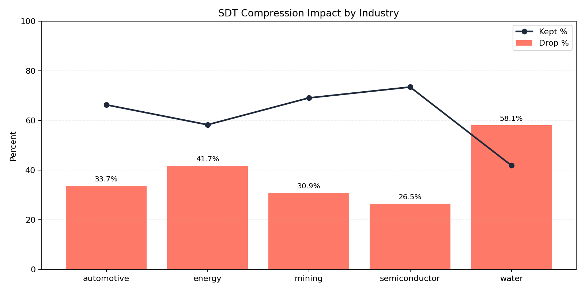
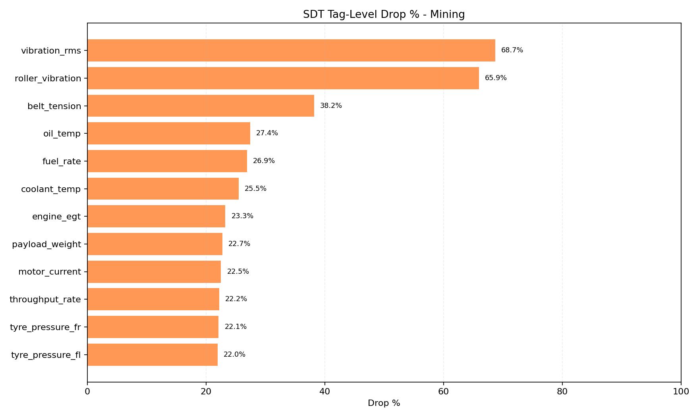
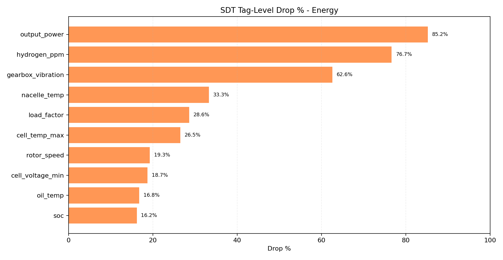
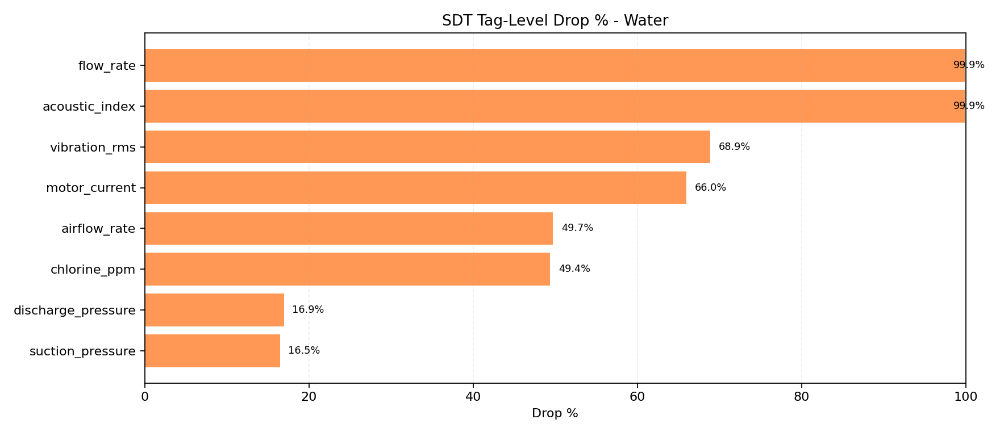
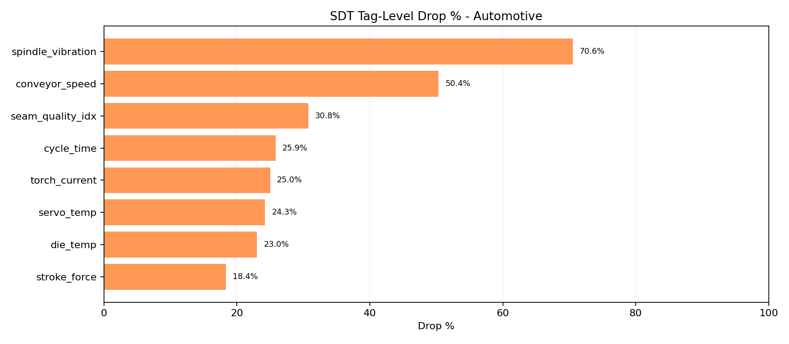
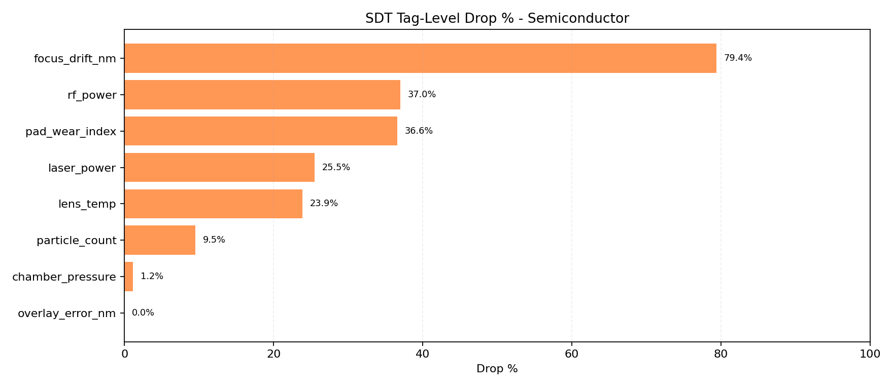

# SDT Compression Report

- Ticks per industry: `1000`
- Base seed: `20260325`
- Method: simulator replay with identical seed, comparing SDT disabled vs enabled

## Overall Compression

| Industry | Raw Points | SDT Kept | Kept % | Drop % |
|---|---:|---:|---:|---:|
| automotive | 5612 | 3722 | 66.32 | 33.68 |
| energy | 9787 | 5704 | 58.28 | 41.72 |
| mining | 19572 | 13523 | 69.09 | 30.91 |
| semiconductor | 5573 | 4095 | 73.48 | 26.52 |
| water | 5609 | 2349 | 41.88 | 58.12 |

## Tag-Level Drop Charts

### Mining

### Energy

### Water

### Automotive

### Semiconductor

