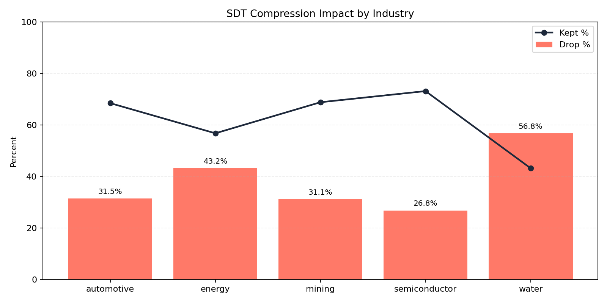
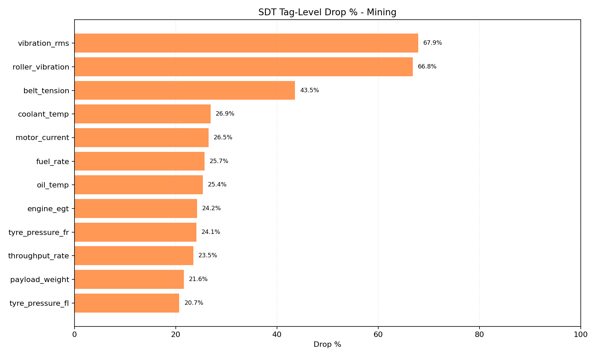
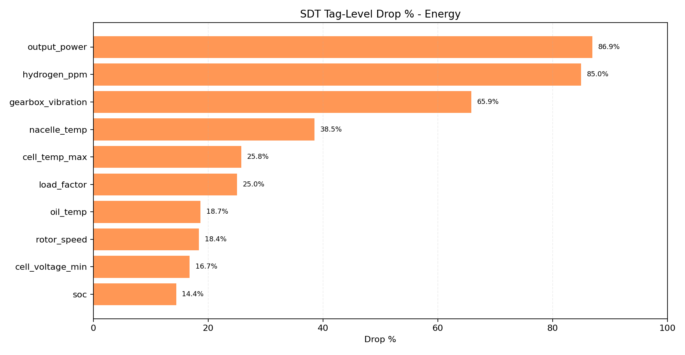
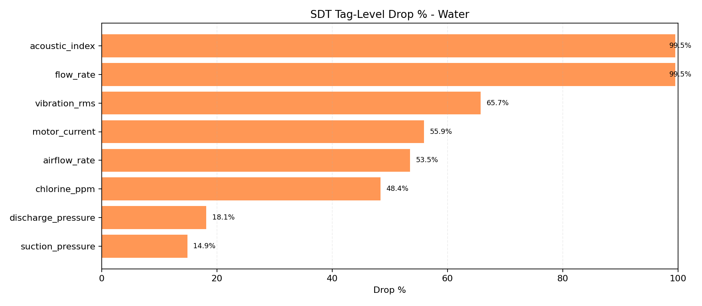
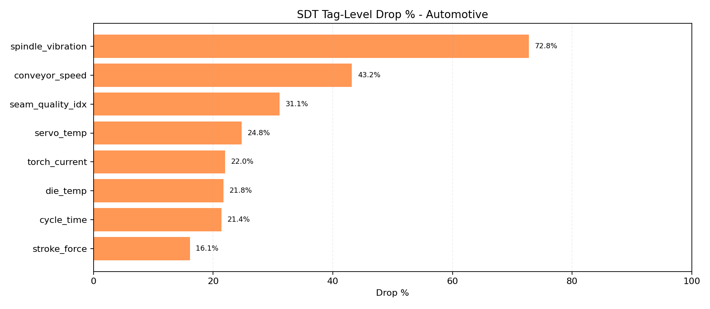
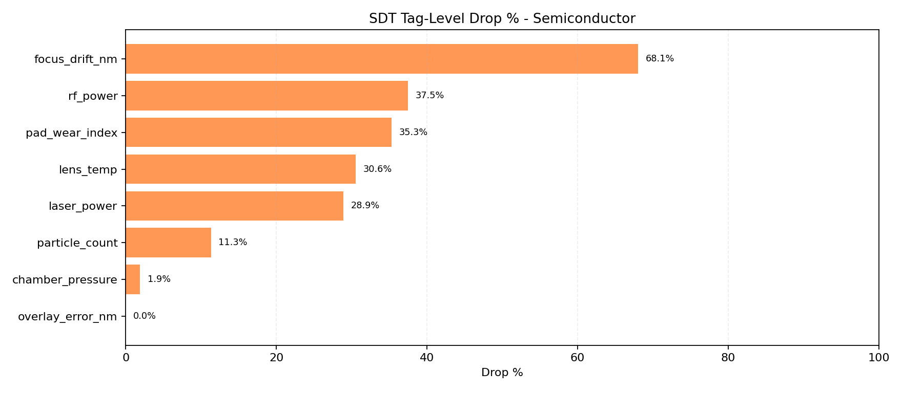

# SDT Compression Report

- Ticks per industry: `300`
- Base seed: `20260325`
- Method: simulator replay with identical seed, comparing SDT disabled vs enabled

## Overall Compression

| Industry | Raw Points | SDT Kept | Kept % | Drop % |
|---|---:|---:|---:|---:|
| automotive | 1663 | 1139 | 68.49 | 31.51 |
| energy | 2939 | 1669 | 56.79 | 43.21 |
| mining | 5814 | 4003 | 68.85 | 31.15 |
| semiconductor | 1655 | 1211 | 73.17 | 26.83 |
| water | 1682 | 727 | 43.22 | 56.78 |

## Tag-Level Drop Charts

### Mining

### Energy

### Water

### Automotive

### Semiconductor

