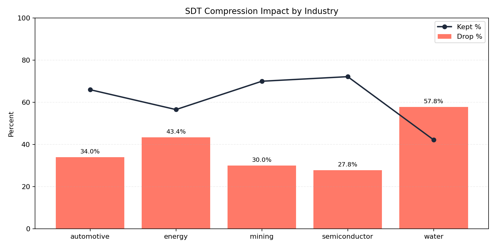
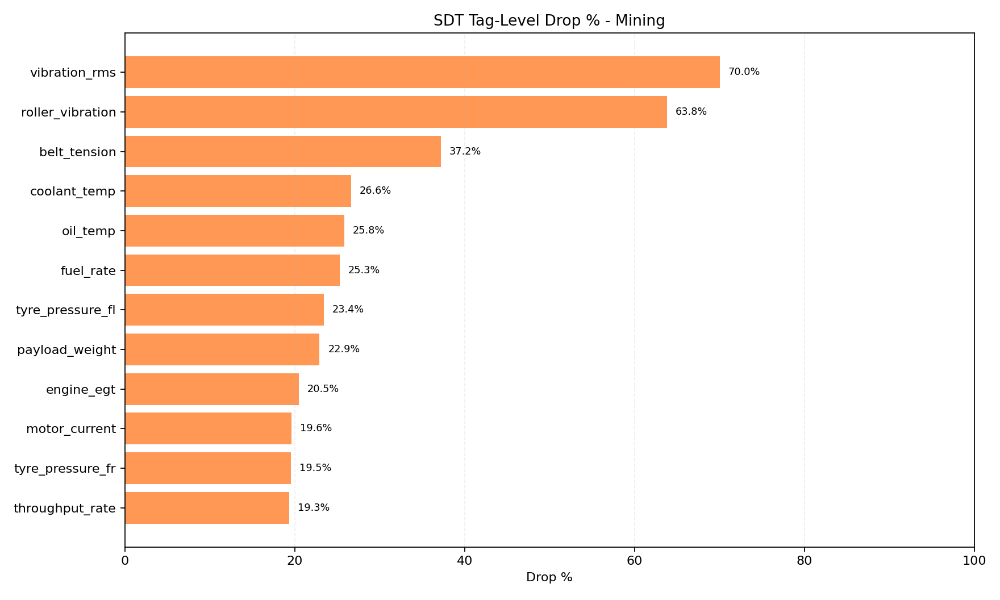
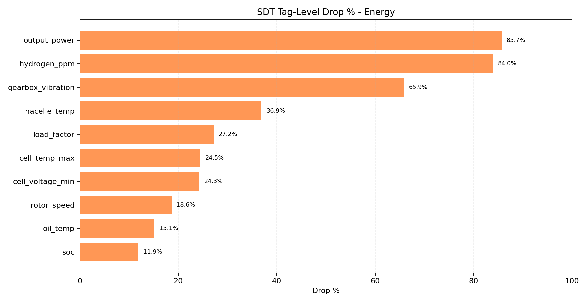
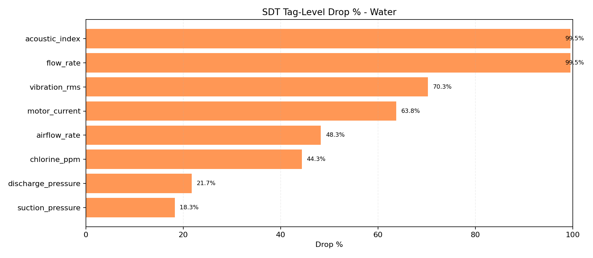
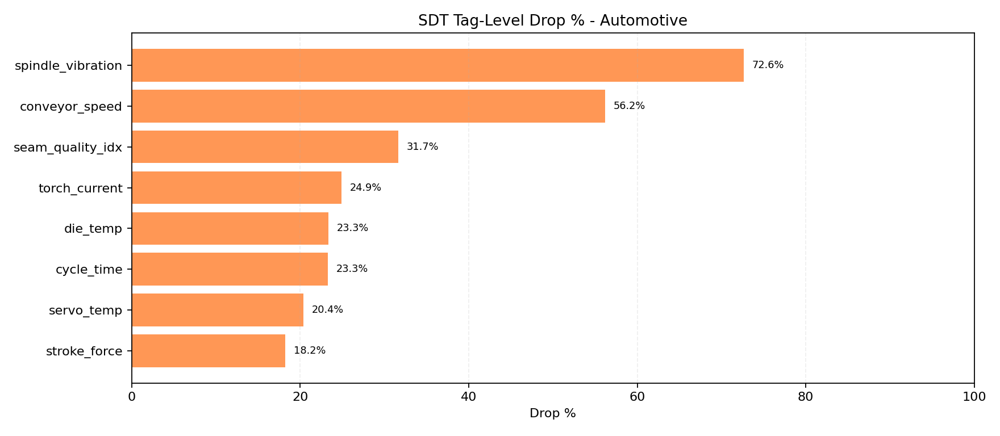
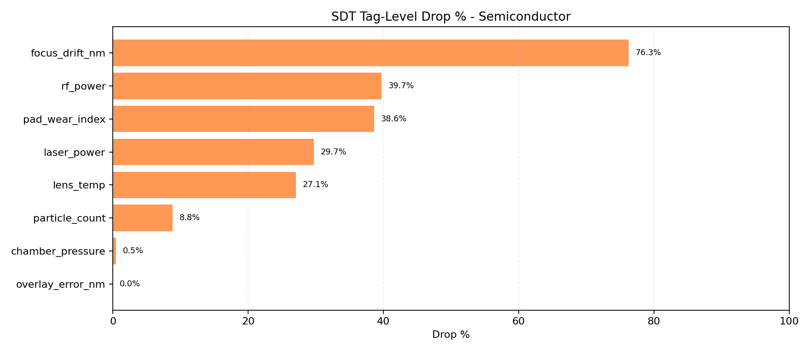

# SDT Compression Report

- Ticks per industry: `300`
- Base seed: `20260325`
- Method: simulator replay with identical seed, comparing SDT disabled vs enabled

## Overall Compression

| Industry | Raw Points | SDT Kept | Kept % | Drop % |
|---|---:|---:|---:|---:|
| automotive | 1656 | 1093 | 66.00 | 34.00 |
| energy | 2933 | 1659 | 56.56 | 43.44 |
| mining | 5895 | 4127 | 70.01 | 29.99 |
| semiconductor | 1682 | 1214 | 72.18 | 27.82 |
| water | 1656 | 699 | 42.21 | 57.79 |

## Tag-Level Drop Charts

### Mining

### Energy

### Water

### Automotive

### Semiconductor

